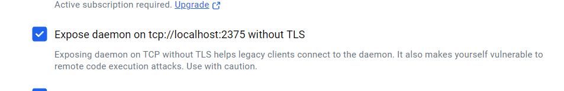
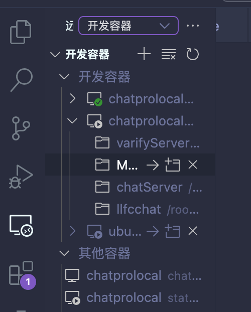

# 容器化开发环境搭建

## 介绍

个人的开发环境是基于远程 Docker 服务器（其实就是内网的一个 Windows Docker Desktop）和 VSCode，做到了双重前后端分离：

- **开发前端（VSCode）和开发环境的分离（Docker Server 里的 Linux）**
- **VSCode 的整体框架和编辑器的分离（Neovim）**

### 好处

- **一次配置，到处运行**
  - 好用的插件、好看的主题集成在 VSCode 里面。
  - Docker 里的开发环境可以简单保存、迁移。
  - VSCode 就算挂了，也不影响环境。
- **Vim 兼容**
  - 使用 `vscode-neovim` 插件，让 Neovim 作为 VSCode 的文本编辑器。
  - VSCode 好用的插件和 Neovim 好用的插件，我全都要。
  - 更适合 Vim 用户的全键盘输入支持。
- **解决了苹果内存太贵的问题（only Apple can do）**
  - 本地开发机仅充当前端，只需要运行 VSCode 和 Docker 客户端。
  - Windows 组装机的内存便宜大碗。

### 坏处

- 需要简单的配置。
- 连不上 Docker Server 的话，作为开发者的生涯大概就要结束了罢（悲）。

让我们开始吧~

---

## Docker

### 什么是 Docker？

简单来说，它是更轻量的虚拟机，通过复用宿主机上的一些依赖，可以使用很少量的资源就能开启一个新的 Linux 环境。

### Docker 的好处

- **快速拉取镜像并启动服务**

  **场景：启动 MySQL**

  **传统方案**：

  > 易？误！什么年代还在手动下载安装改配置？

  **Docker 方案**：

  ```bash
  docker run --name mysql -p 3307:3306 -e MYSQL_ROOT_PASSWORD=123456 -d mysql
  ```

  没错，你已经起了一个密码是123456的mysql容器了，怎么样，docker很神奇吧！
- **易保存、迁移**
  - 可以打包成 `.tar` 文件到处传播。
  - 可以打上标签上传到 Docker Hub到处传播。
  - 可以使用 `Dockerfile` 进行镜像优化然后到处传播。

### 对比其他方案

- **虚拟机**：太重，启动慢，文件互通需要 VMware Tools 支持，网络配置复杂(我不明白~)
- **WSL**：对 GUI 支持差，环境隔离性不佳。
>那么这么好用的工具，去哪里下载呢？度娘和谷爹会告诉你一切。
		 那么这么好用的工具，具体来说怎么用呢？很多人做过相关的教程，b站会告诉你一切。
		 本文只会涉及一些有难度的用法。
     比如，网络问题:`我缺的dockerhub这块谁给我补啊`
### 网络问题解决方案

- **方案一：镜像源加速**
- **方案二：魔法网络**（Windows Docker Desktop 默认支持）

如果魔法不生效，尝试 **TUN 模式**.简单来说，大部分软件默认是不走代理的（没想到吧！也就浏览器会走走代理），是否使用系统代理，这是软件自己决定的。我们可以通过一些软件的设置让它使用代理，或者是---强制爱。
			TUN会模拟出一张虚拟网卡，所有流量都会经过这张网卡，愿不愿意，可由不得你了

---

## Docker Server

如果使用本地 Docker，可以跳过此部分。

### 启动 Docker Server

首先，打开 Windows Docker Desktop 的以下选项：

> 

启用后，Docker Server 会在 `127.0.0.1:2375` 暴露一个无 TLS 加密的端口。这样，只要能够让别的机器访问到windows的localhost:2375就可以使用docker服务了。这种事情，真的做的到吗？

**如何远程访问？**

- **方案 1：端口转发**
  - 把 `localhost:2375` 端口转发到可访问的子网。
- **方案 2：SSH 端口转发**

  ```bash
  ssh -L localhost:2375:localhost user@windowServerIp
  ```

  可使用 `autossh` 维持该连接：

  ```bash
  autossh -M 20001 -f -N -L 2375:localhost:2375 user@windowsServerIp
  ```

### 连接 Docker Server

1. **测试连接**

   ```bash
   docker ps
   ```

2. **如果未连接成功，尝试使用 Docker Context**

   ```bash
   docker context create my_context --docker="host=tcp://localhost:2375"
   docker context use my_context
   ```

3. **在 Windows 上开放 `2375` 端口的入站和出站规则（若使用 SSH 方式可跳过）。**

---

## 创建 Ubuntu 开发环境

### 在 Docker 里启动 Ubuntu 容器

```bash
docker run --name ubuntu_dev -itd ubuntu:22.04
```

### 使用 VSCode 连接到容器

在 VSCode 远程开发插件中找到容器，进入容器。

> 

>然后，呼出命令行，你可以像在本地使用Linux一样使用这个容器了。
你的代码会保存在容器里，会使用容器里的编译器编译。
关于C++容器里的环境的搭建和推荐的容器会在后面说，熟悉的同学可以自己开始动手了。
---

## Neovim 适配 VSCode

### 配置步骤

1. **下载 VSCode Neovim 插件**（该插件会将 VSCode 的编辑器替换为 Neovim）。
2. **如果本地有 Neovim 配置，建议增加检查逻辑**，确保在 VSCode 中不启用部分插件。
3. **解决 Neovim 无限加载问题**（如打开多个窗口或使用 Copilot 时出现卡顿）：
   - 本地下载 Neovim `0.9.4` 版本。
   - 使用 `1.18.9` 版本的 VSCode Neovim 插件。
   - 在插件设置中指定本地 Neovim 版本。
4. **调整 VSCode 快捷键**，优化 Neovim 在 VSCode 里的使用体验。

---

## 总结

恭喜你，现在你已经拥有了一套 **分布式、前后端分离** 的开发环境！
